Thompson Sampling
==========================================

Created by Chia, Jonathan on Apr 09, 2022

_Also referred to as the Bayesian Bandit_

This article is written assuming a basic understanding of Bayesian statistics, A/B testing, and conjugate priors

  
This article is a summary of the lessons found in the below link:

[https://udemy.com/course/bayesian-machine-learning-in-python-ab-testing/](https://jtv.udemy.com/course/bayesian-machine-learning-in-python-ab-testing/)

Introduction:
=============

Thompson Sampling is one of the best multi-armed bandit A/B testing algorithms. In my opinion, it is also the most beautiful to implement! 

  

But before we jump into Thompson Sampling, here is a quick overview of multi-armed bandit algorithms.

Multi-Arm Bandit Algorithms:
============================

Multi-Arm Bandit algorithms address the key problem we see in A/B testing: half of the test subjects receive the worse treatment.

Let's say we are doing an experiment on a new cancer drug. In order to find out if the drug actually works, we have to split cancer patients into a control and a treatment group. 

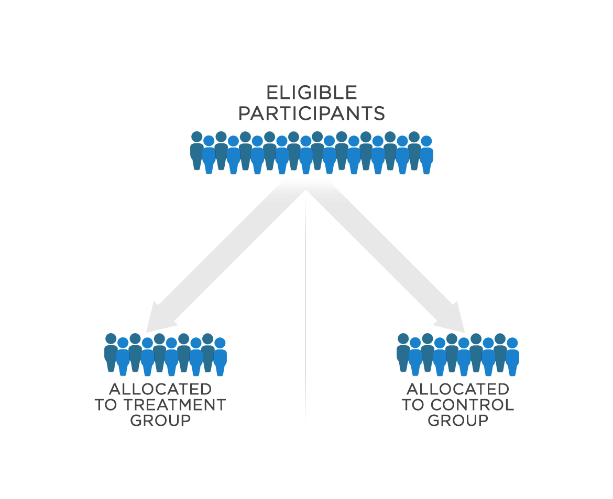

Do you see the problem here?? The A/B test is prioritizing figuring out if the drug is effective over saving as many people as possible. 

This is the problem known as the **Explore-Exploit** Dilemma

Understanding the drug = Explore

Giving the most people possible the drug (assuming the drug is effective) = Exploit

We could give most of the patients the drug (exploit) but then we wouldn't have enough data to statistically prove that the drug is better than a control. It's all about finding the best balance!

  

Multi-Arm Bandit algorithms balance exploring and exploiting, and each algorithm does so in different ways.

Instead of pre-assigning two groups, multi-arm bandit algorithms adjust and update as the experiment goes on. So for this drug trial, instead of giving half the people the treatment at once, we would iteratively give the treatment or the control. Then, the algorithm would keep updating each iteration. Once the algorithm starts to see that the drug is better, the algorithm will assign more people the treatment instead of the control.

  

Thompson Sampling Intuition:
============================

Suppose we have 3 advertisements, each with a set but unknown probability of being clicked. We want to find out which advertisement has the highest click-through rate


Each advertisement has probability theta which can be represented using a beta distribution:


_The reason we choose a beta is because it has a range from 0 to 1._

  

Each ad outputs either a click or no click (1 or 0). This is the likelihood:

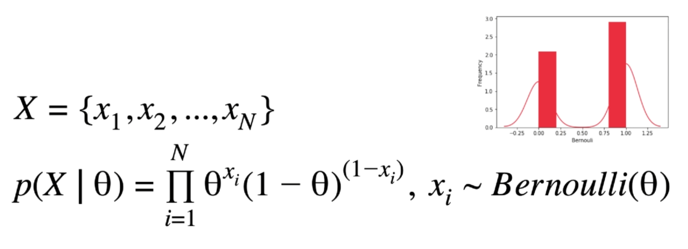

  

Using bayes rule, we can find a posterior probability for the click-through rate


Because the beta distribution is a conjugate prior for Bernoulli likelihood, that means the posterior is also a beta distribution!


After we get more data, this posterior we just found, is used as a prior to find an updated posterior.

  

**That's nice, but what does this have to do with A/B testing?**

Think about the benefits of using Bayesian statistics. Each time we gather data on the ads, the estimated click-through rate probability can be updated. That means that as we test the ads, we will be able to figure out which ad is best **during** the experiment instead of at the very end. 

Thompson Sampling Process:
==========================

1.  Assign each slot machine a beta prior of beta(1,1) - a uniform distribution
    1.   We don't know anything about the slot machines' win rates so we assign an equally weighted probability distribution
    2.   This is a picture of a uniform distribution: 
    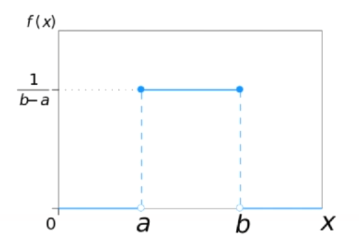 
2.  Pull a sample probability from each of the ads' distributions
3.  Whichever ad has the sampled highest probability, we display that to the next customer
4.  This time the customer didn't click
5.  Update that ad's probability distribution - the new probability distribution (posterior) becomes the prior for the next time you update 

Initial probability distribution:

 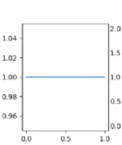

Updated probability distribution:

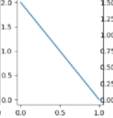 0/1 clicks

6. Repeat steps 1-5 

  

What you end up getting is something like this:

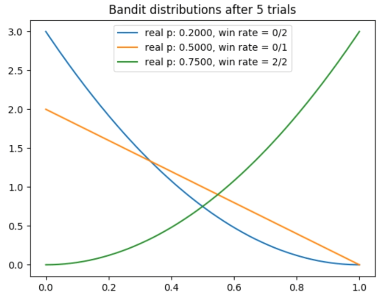

The blue line - representing the worst ad (with a real probability of .2) - has a probability distribution that is denser on the left. Because it has lost 2 times, the probability is likely on the lower end

The red line - representing the best ad (with a real probability of .75) - has a probability distribution that is denser on the right because it has won two times.

  

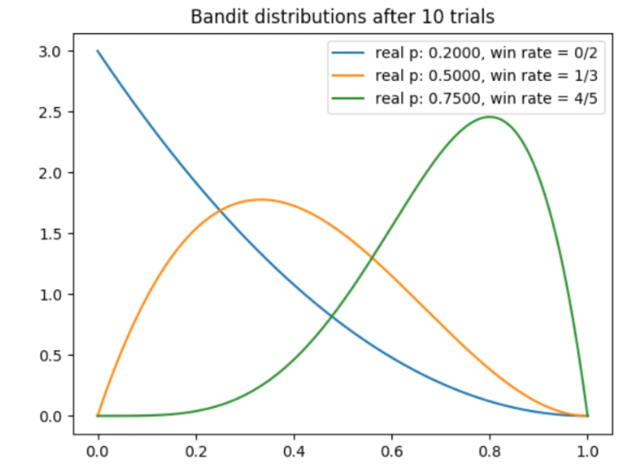

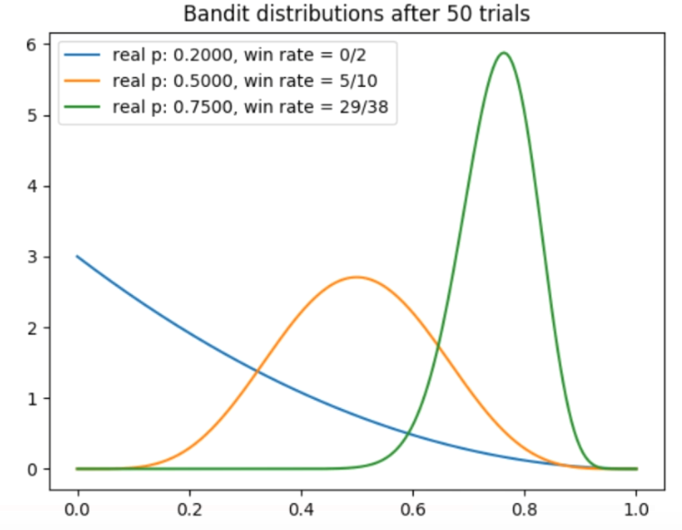

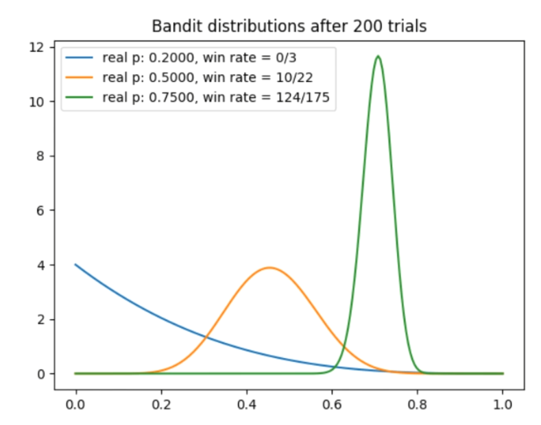

Notice that we have shown the red ad 175 times! Why haven't we shown the other ads as much?

**Look at step number 2 and 3 in the process. This is the key to the explore-exploit dilemma for the thompson sampling algorithm.**

  

_2. Pull a sample probability from each of the ads' distributions_

_3. Whichever ad has the highest sampled probability, we display that to the next customer_

  

Based on the probability distributions, the algorithm decides which ad to test. 

For example, when we run trial number 201, the algorithm will pull a sample from each of the three distributions. 

The red distribution ranges from about .6 to .8 so this time the sample pulls a .75

The yellow distribution ranges from about 0 to .8 and this time the sample pulls a .4

The blue distribution has a sample pull of .1

  

The red distribution has the higher sample so it will be shown again, but we can see that sometimes the red distribution will not win due to randomness.

For example, let's say we run trial number 202.

The red distribution pulls a .60.

The yellow distribution pulls a .62

The blue distribution pulls a .04.

  

This time the yellow distribution wins so we will show the yellow ad next.

  

The algorithm is awesome because initially, it tests all three ads, but after we start to literally narrow down which ad is better, the algorithm will show most of the customers the red ad. 

THEREFORE, THOMPSON SAMPLING **EXPLORES** WELL IN THE BEGINNING, FINDS THE BEST OPTION, AND THEN **EXPLOITS** THAT OPTION THE MOST AT THE END

**Because the probability distributions have a spread, we allow for randomness that helps the algorithm to explore**

**Because the probability distributions narrow, the algorithm is able to exploit more**

Code:
=====

For this code example, we are running a simulation to show that the algorithm actually works; therefore, we start with the true probabilities for the three ads.

```python
import matplotlib.pyplot as plt
import numpy as np
from scipy.stats import beta

np.random.seed(2)
BANDIT_PROBABILITIES = [0.2, 0.5, 0.75]
NUM_TRIALS = 2000
```

We create a class with two functions. The pull function simulates an ad click based on the true probability of the ad. The update function updates the beta coefficients (which then updates the probability distribution) after each additional data point.

```python
class BanditArm:    
	def __init__(self, p):        
		# p: the win rate        
		self.p = p        
		self.a = 1   # alpha 1 and beta 1 is the uniform prior distribution     
		self.b = 1        
		self.N = 0    

	def pull(self):        
	# draw a 1 with probability p        
	return np.random.random() < self.p        
	# an alternative is np.random.choice(np.array([1, 0]), size=1, replace=True, p=[self.p, 1-self.p])    

	def update(self, x):
		self.N += 1        
		self.a = self.a + x        
		self.b = self.b + 1 - x
```

The update function above uses this posterior:


```python
alpha_new = alpha_old + x (there's only one x since we are going iteratively)

beta_new = beta_old + 1 - x (there's only one x and 1 N since we are going iteratively)
```

Then we run the experiment

```python
def experiment():    
	bandits = [BanditArm(p) for p in BANDIT_PROBABILITIES]    
	rewards = np.zeros(NUM_TRIALS)    
	num_optimal = 0    
	total_number_completed_trials = 0    
	optimal_j = np.argmax([b.p for b in bandits])    
	print("optimal j:", optimal_j)    

	for i in range(NUM_TRIALS):        

		j = np.argmax([beta.rvs(b.a, b.b) for b in bandits]) # LOOK HERE - this is where we get a sample from each distribution and choose the highest one     

		if j == optimal_j:            
			num_optimal += 1        

		# simulate showing one ad to customer and then receiving a click or no click        
		x = bandits[j].pull()        

		# update rewards log        
		rewards[i] = x        

		# update the distribution for the bandit whose arm we just pulled        
		bandits[j].update(x)    

		# print mean estimates for each bandit    
		for b in bandits:        
			print("mean estimate:", beta.rvs(b.a, b.b))    

		# print total reward    
		print("total reward earned:", rewards.sum())    
		print("overall win rate:", rewards.sum() / NUM_TRIALS)    
		print("num times selected optimal bandit:", num_optimal)    
		print("num times selected each bandit:", [b.N for b in bandits])    
		# plot the results    
		cumulative_rewards = np.cumsum(rewards)    
		win_rates = cumulative_rewards / (np.arange(NUM_TRIALS) + 1)    
		plt.plot(win_rates)    
		plt.plot(np.ones(NUM_TRIALS) * np.max(BANDIT_PROBABILITIES))    
		plt.show()    
		
		# show final posterior distributions
		for b in bandits:        
			x = np.linspace(0, 1, 200)        
			plt.plot(x, beta.pdf(x, b.a, b.b))    
			plt.show()

if __name__ == "__main__":    
    experiment()
```

Output:

The algorithm figures out the best ad at about 500 trials

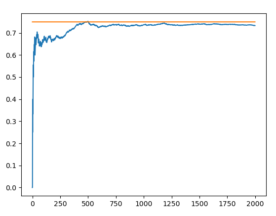

Final distributions

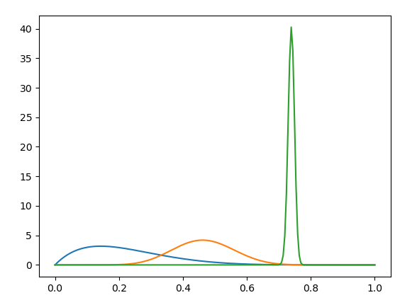


Estimate of the true probability - the algorithm performed pretty well with the best ad, but was quite off for the 1st and 2nd ad. We didn't explore the 1st and 2nd ad enough to get close to the true probability but the benefit is we instead exploited the 3rd ad.


Attachments:
------------

 [image2021-3-10_16-2-2.png](attachments/95650130/95650131.png) (image/png)  
 [image2021-3-10_16-1-41.png](attachments/95650130/95650132.png) (image/png)  
 [image2021-3-10_16-1-23.png](attachments/95650130/95650133.png) (image/png)  
 [image2021-3-10_15-59-57.png](attachments/95650130/95650134.png) (image/png)  
 [image2021-3-10_15-52-33.png](attachments/95650130/95650135.png) (image/png)  
 [image2021-3-10_15-25-24.png](attachments/95650130/95650136.png) (image/png)  
 [image2021-3-10_15-24-9.png](attachments/95650130/95650137.png) (image/png)  
 [image2021-3-10_15-21-16.png](attachments/95650130/95650138.png) (image/png)  
 [image2021-3-10_15-10-8.png](attachments/95650130/95650139.png) (image/png)  
 [image2021-3-10_15-10-5.png](attachments/95650130/95650140.png) (image/png)  
 [image2021-3-10_15-10-4.png](attachments/95650130/95650141.png) (image/png)  
 [image2021-3-10_15-10-3.png](attachments/95650130/95650142.png) (image/png)  
 [image2021-3-10_14-58-38.png](attachments/95650130/95650143.png) (image/png)  
 [image2021-3-10_14-55-50.png](attachments/95650130/95650144.png) (image/png)  
 [image2021-3-10_14-55-16.png](attachments/95650130/95650145.png) (image/png)  
 [image2021-3-10_14-52-13.png](attachments/95650130/95650146.png) (image/png)  
 [image2021-3-10_14-48-40.png](attachments/95650130/95650147.png) (image/png)  
 [image2021-3-10_14-48-18.png](attachments/95650130/95650148.png) (image/png)  
 [image2021-3-10_14-48-12.png](attachments/95650130/95650149.png) (image/png)  
 [image2021-3-10_14-47-3.png](attachments/95650130/95650150.png) (image/png)  
 [image2021-3-10_14-46-4.png](attachments/95650130/95650151.png) (image/png)  
 [image2021-3-10_14-35-6.png](attachments/95650130/95650152.png) (image/png)  
 [image2021-3-10_14-23-43.png](attachments/95650130/95650153.png) (image/png)  
 [image2021-3-10_14-21-26.png](attachments/95650130/95650154.png) (image/png)  
 [image2021-3-10_14-19-11.png](attachments/95650130/95650155.png) (image/png)  
 [image2021-3-10_14-17-51.png](attachments/95650130/95650156.png) (image/png)  
 [image2021-3-10_14-11-32.png](attachments/95650130/95650157.png) (image/png)  

Document generated by Confluence on Apr 09, 2022 16:54

[Atlassian](http://www.atlassian.com/)