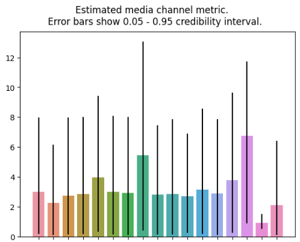

# Lightweight Media Mix Model

*My notes on Google's Lightweight MMM, as well as some outputs from my most recent model built at work.*

## MMM Purpose

Find each marketing channel's efficiency to guide quarterly marketing budget decisions.

The key is once you have the MMM you can start experimenting. For example, if you want to know if one strategy is better than the other, you can spend a month increasing one strategy and decreasing the other. Additionally, you can continue to monitor how good the MMM is predicting the future as a measure of its effectiveness. 

## Strengths

* Bayesian Framework allows us to utilize prior knowledge to push model training in the right direction (can use CLS to give estimate on true ROI of a campaign)
* Handles multicollinearity better compared to a regression model - instead of a positive and a negative effect in a regression, it will show higher uncertainty but positive effects for the two correlated campaigns. See this [article](https://getrecast.com/how-d2c-brands-can-deal-with-multicollinearity-in-their-marketing-mix-modeling/#:~:text=One%20preliminary%20method%20to%20detect,above%20typically%20indicates%20high%20multicollinearity.).
* Has built in budget optimizer.
* Has built in features to handle seasonality.
* Very easy to use compared to Robyn or building it yourself.

## Weaknesses 

Most in-house MMM models have these weaknesses - you have to hire an MMM consulting company to overcome these:
* Doesn't have as fancy of adstock curves compared to Robyn.
* Assumes seasonality is independent of marketing performance (that's not the case).
* Assumes promotional activities are independent of marketing performance (also not the case).
* Doesn't take into account the funnels - top MMM companies will put brand search as an intermediate outcome in their models (spends -> brand search -> revenue).
* Account for recent performance (Robyn kind of has a method to do this, Recast measures one time period then uses that posterior as a prior for the next time period).
    * We can do this by fitting a model on the previous year, using that posterior as the priors for this year. (this is pretty easy).
    * For seasonality, we can ignore using the built in seasonality features, and built it ourselves as a control variable. (this will be very hard).
* Selection Bias - a change in sales could be cause by ad spend OR by consumer demand increasing (can we measure using Google Trends? The problem is we would be assuming demand is independent).
* Search ad effectiveness will be overstated since we are using a naive model - see this [paper](https://arxiv.org/abs/1807.03292)
* Relies much more on the data scientist whereas vendor solutions structure analysis and visualize results so that everyone can participate in measurement and modelling process - see this [article](https://blog.scanmarqed.com/open-source-mmm-vs-strataqed).
* Doesn't handle interactions.
* Doesn't account for pull-forward or pull-backward effects (before and after Black Friday, customers spend less).

See this [article](https://getrecast.com/recast-vs-lightweight-mmm/) for comparison of Recast and Lightweight MMM.

See this [article](https://medium.com/towards-data-science/understanding-bayesian-marketing-mix-modeling-a-deep-dive-into-prior-specifications-af400adb836e) for explanation of Bayesian model.

## Data

Inputs:

* Daily Digital Marketing Spends - programmatic banner ads, search, social media, affiliates, etc.
* Economic Variables such as inflation.
* Traditional Marketing Spends - TV, print, radio.
* Other control variables such as competitor sales, email sends, etc.

Outputs:

* Revenue

Potential additional inputs:
* Price variables (could guestimate this for predictions).
* Weather (can't use this for predictions though).

## Getting Started with Model Development

Make sure you are running python 3.8, 3.9, or 3.10. 

Next, see the following documentation:
* https://lightweight-mmm.readthedocs.io/en/latest/index.html
* https://github.com/google/lightweight_mmm

## Key Problems

* Multicollinearity - let's try to make this a bit less so the model has smaller credible intervals.
    * JUMP Data Scientists said don't worry about VIFs too much as long as the output of the model makes intuitive business sense and the MAPE are good.
* Establishing good priors - not sure how to do this yet.
* How to gauge recent performance (like last year?) - fit a model on just last year but model will not be as good because it will lack seasonality learnings.

See this Google research [paper](https://static.googleusercontent.com/media/research.google.com/en//pubs/archive/45998.pdf) for an overview of challenges in MMM.

## Potential for Geo-Level MMM?

If you have good data tracking on a geo-level, this is perferred because the model performs much better. 

## How MMM can be used with MTA?

Google proposes using MMM to capture interaction effects in MTA.

For example, if we want to see how broadcast has contributed to Criteo, we could fit an MMM model on where y = attributed sales for Criteo and x = all the different spends.

See this [paper](https://www.thinkwithgoogle.com/_qs/documents/13385/TwGxOP_Unified_Marketing_Measurement.pdf).

## How to Know if a Control Variable is Good?

If it helps model MAPE then the control variable is good.

## Verifying the Model is Decent using MAPE

First, you see if the training data was fit well:

Then, you see if your testing data MAPE is good (generally below 20% is good according to Google):

    sample: 100%|██████████| 2000/2000 [00:52<00:00, 37.74it/s, 511 steps of size 8.34e-03. acc. prob=0.96]
    

    model_name=hill_adstock degrees=3 MAPE=0.0672490801062182 samples=[     2115567.000      2072714.375      2408643.500]

In my case, the model had a 6.7% MAPE!

## Using the Model for Budgeting Decisions

Once you've verified your model is decent and makes intuitive business sense, we can start using it!

For budgeting decisions, I mostly rely on the ROI chart:

Each of these bars represents a different marketing channel (names hidden because it is confidential).

Based on this info, I would next design an experiment:

1. Increase the budget of the best channel by 20%. 
2. Have the model output predicted revenue based on this budget change.
3. Implement the budget changes and see if our revenue is as we predicted.
4. If the model predictions were correct and our revenue increased, we have succeeded! We can also update the priors for that channel so it's more accurate.
5. If the model predictions were not correct and our revenue did not increase, we can update the priors to show more uncertainty.
6. Continue to experiment. 

