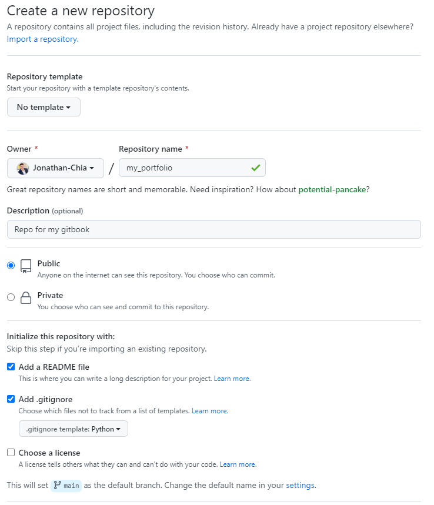
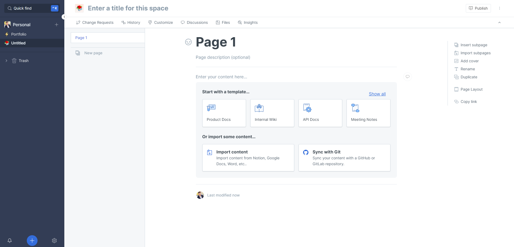
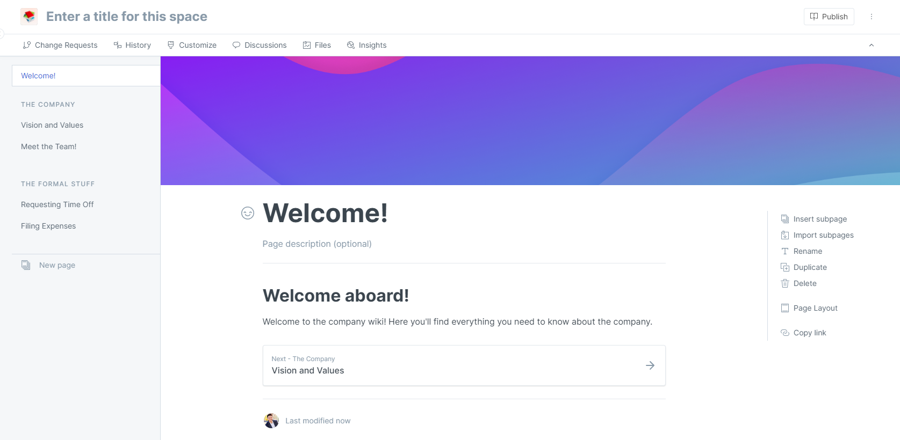
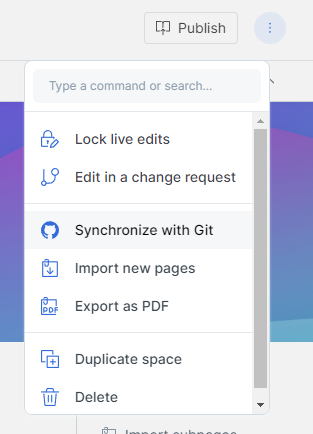
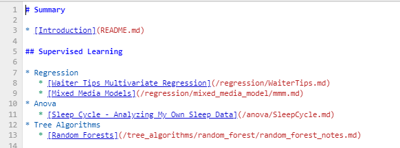

April 10, 2022

# Introduction


GitBook is a powerful document editor that integrates seamlessly with Github. 

By reading this article, you will be able to set up your own Data Science portfolio website using GitBook in less than 30 minutes.

# Table of Contents

* [Why Use GitBook over Other Options](#why)
* [Creating Your First GitBook Website](#create)
    * [0. Create a Github Account](#create_0)
    * [1. Create a New Repository in Github](#create_1)
    * [2. Create a GitBook Account](#create_2)
    * [3. Create a Space](#create_3)
    * [4. Synchronize GitBook with your Github Repository](#create_4)
    * [5. Choose a Priority](#create_5)
    * [6. Edit your ReadMe](#create_6)
    * [7. Create a Summary.md File](#create_7)
* [Creating Content for Your Website](#content)
    * [0. Learn How to Use Markdown](#content_0)
    * [1. Convert Previous Projects into Markdown](#content_1)
        * [Converting Python Notebooks](#content_1_1)
        * [Converting HTML Files](#content_1_2)
        * [Converting R Markdown Notebooks](#content_1_3)
        * [Displaying Images in Your Markdown Files](#content_1_4)
    * [2. Put Your Content in Github and Reference Them in Your Summary.md](#content_2)
* [Conclusion](#conclusion)   

# Why Use GitBook over Other Options <a name="why"></a>

**Advantages**:

* Free website hosting
* Quick setup
* Integration with Github
* Mobile friendly

**Disadvantages:**

* Lacking in detailed documentation
* Have to use Markdown (not sure how to show HTML documents)
* Less customization compared to hosting your own personal website

**Use GitBook if you want to create a portfolio quickly without the hassle of having to code your own website**

# Creating Your First GitBook Website <a name="create"></a>

## 0. Create a Github Account <a name="create_0"></a>

[Get Started With Github Account](https://docs.github.com/en/get-started/onboarding/getting-started-with-your-github-account)

## 1. Create a New Repository in Github <a name="create_1"></a>

You can create it through the terminal or on the github website.

I created mine on the github website like this:



## 2. Create a GitBook Account <a name="create_2"></a>

Go to [GitBook.com](https://www.gitbook.com/) and create a free account. You can use your github login to sign in. 


## 3. Create a Space <a name="create_3"></a>

Click the blue + symbol on the bottom left and create a new Space.



In the start with a template section, click on 'Internal Wiki'. 

Now the page will look like this:



Feel free to personalize your Space by naming your Space, changing the theme, changing the symbol in the upper-left corner, etc.

## 4. Synchronize GitBook with your Github Repository <a name="create_4"></a>

Click on the 3 dots in the top right corner and then click on 'Synchronize with Git':



Click configure, and then click 'Connect with Github'.


Link your new repository:


## 5. Choose a Priority <a name="create_5"></a>

There are two options. Click Github to Gitbook for now (you can change it later if you want).


Synchronize.

## 6. Edit your ReadMe <a name="create_6"></a>

Go to your Github Repository that you just linked to GitBook, and edit your ReadMe file. You can edit it through the Github website, or you can clone your repository to your favorite IDE and edit it in your IDE.

**Editing in Github website:**


**Editing in Your Favorite IDE:**

I cloned my repository into Jupyter Lab and edit in there.


Introduce yourself and your portfolio however you would like!

## 7. Create a Summary.md File <a name="create_7"></a>

Your Summary.md file tells GitBook how to organize your Space.

For example here is my Summary.md file:



And here is what my Space looks like:


After clicking on the regression tab you can see the articles in it:


---

**Now that the framework for the website is all set up, we need to add content to link into your Summary.md!**

# Creating Content for Your Website <a name="content"></a>

GitBooks takes Markdown, HTML, or Word files. I'm not sure how to use HTML or Word files in GitBook, but see below for help with Markdown files.

## 0. Learn How to Use Markdown <a name="content_0"></a>

[Getting Started With Markdown](https://www.markdownguide.org/getting-started/)

## 1. Convert Previous Projects into Markdown <a name="content_1"></a>

Do you have any previous coding notebooks that you want to display in your portfolio? You can convert .html, .Rmd, and .ipynb files into Markdown. 

Do you have any presentations, reports, or papers that you want to display in your portfolio? You can display your documents in your Markdown files by linking them.

### Converting Python Notebooks <a name="content_1_1"></a>

Run this line of code in your terminal. This will create a markdown file with the same name and also create a folder with images/attachments that are from the notebook.

```linux
jupyter nbconvert --to markdown your_notebook.ipynb
```

### Converting HTML Files <a name="content_1_2"></a>

I like to use [codebeautify.org](https://codebeautify.org/html-to-markdown) to convert html to markdown. You just copy and paste into the converter. 

Please feel free to contact me and let me know if you have a better tool!

### Converting R Markdown Notebooks <a name="content_1_3"></a>

Run this line of code in R.

```r
library(rmarkdown)
render('your_notebook.Rmd', md_document())
```

See [md_document](https://rmarkdown.rstudio.com/docs/reference/md_document.html) function for further reference.

### Displaying Images in Your Markdown Files <a name="content_1_4"></a>

I wrote a blog post in canva and saved each page as an image.

My markdown file looks like this:

```markdown


```

I did the same thing for a powerpoint presentation. I saved every slide as an image and then linked them in a Markdown file.

## 2. Put Your Content in Github and Reference Them in Your Summary.md <a name="content_2"></a>

For an example of how to organize your Github Repository, take a look at my own repository and the Summary.md file.

* [Jonathan-Chia/portfolio](https://github.com/Jonathan-Chia/portfolio)
* [Summary.md](/portfolio/Summary.md)

Feel free to look at my Markdown files to see how I wrote them as well.

---

# Conclusion <a name="conclusion"></a>

GitBook is a fantastic platform to host Data Science portfolios. 

Here are some additional resources:

* [GitBook Docs](https://docs.gitbook.com/)
* [Coursera: How to Build a Data Analyst Portfolio](https://www.coursera.org/articles/how-to-build-a-data-analyst-portfolio)
* [DataQuest: Help Your Data Science Career By Publishing Your Work!](https://www.dataquest.io/blog/publish-data-science-work-2022/)

I hope you will use your portfolio to not only impress employers but also keep useful notes that will help you throughout your career. Good luck!