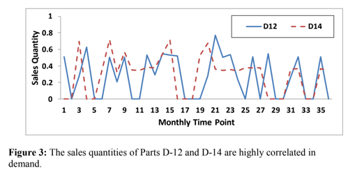

Created by Chia, Jonathan on Apr 09, 2022

# Introduction

Below are some of my notes on how to use time series clustering vs. market basket analysis to find complement products. 

In the end, I think state-of-the-art recommender systems are the better solution; however, I think time series clustering is an interesting topic!

# Table of Contents

* [Case Study](#case_study)
* [Strengths](#strengths)
* [Problems](#problems)
* [Why Euclidean Distance is Wrong](#euc)
* [Quantity Sold vs. Available](#quant)
* [Complements vs. Substitutes](#compl)

# Case Study 

**See this paper for full information:**

[https://docs.google.com/viewer?a=v&pid=sites&srcid=ZGVmYXVsdGRvbWFpbnxhbmFseXRpY3NvZnRoaW5nc3xneDozNjlhODI1Mjg5ZjdlMjhl](https://docs.google.com/viewer?a=v&pid=sites&srcid=ZGVmYXVsdGRvbWFpbnxhbmFseXRpY3NvZnRoaW5nc3xneDozNjlhODI1Mjg5ZjdlMjhl)

  

**Output:**

After time series clustering, D12 and D14 were found to be in the same cluster

  

**How the data would look before clustering:**

  

  

 

# Strengths: 

*   Bypasses the need for a large matrix for association rule mining, which usually ends up being sparse and leading to redundant and not very useful rules
*   Instead of having a row for each basket, you have a row for each product, so data is way smaller
*   "Time series clustering can be used to identify products that are commonly  
    purchased across a certain time period. Such patterns are otherwise hard to  
    discover using association rule mining, which analyses transactions  
    without temporal consideration."

  

# Potential Problems: 

*   Product quantity sold is quite low in general since we have so many products
*   Products may be correlated by random chance - especially if they are not bought very often
*   We have thousands and thousands of different products
*   It might be better to group products by product attributes instead of doing individual products

  

# Why Euclidean distance is Wrong 

**[https://towardsdatascience.com/how-to-apply-k-means-clustering-to-time-series-data-28d04a8f7da3](https://towardsdatascience.com/how-to-apply-k-means-clustering-to-time-series-data-28d04a8f7da3)**

  

**[https://tslearn.readthedocs.io/en/stable/gen\_modules/neighbors/tslearn.neighbors.KNeighborsTimeSeries.html](https://tslearn.readthedocs.io/en/stable/gen_modules/neighbors/tslearn.neighbors.KNeighborsTimeSeries.html)**

  

  

  

# Quantity Sold vs. Available 

Check to see if the reason the product drops right after peaking is because of lack of supply

  

  

# Complements or Substitutes? 

Cross join all the products to get a table like in 

[https://towardsdatascience.com/retail-analytics-a-novel-and-intuitive-way-of-finding-substitutes-and-complements-c99790800b42](https://towardsdatascience.com/retail-analytics-a-novel-and-intuitive-way-of-finding-substitutes-and-complements-c99790800b42)

one problem: we cannot find substitutes because jewelry that are substitutes will never be bought together so the substitute formula proposed in the article would not work

we could check if they are complements by referencing the market basket table (maybe we can lower the parameters so we have more data)

  
---

Document generated by Confluence on Apr 09, 2022 16:54

[Atlassian](http://www.atlassian.com/)
