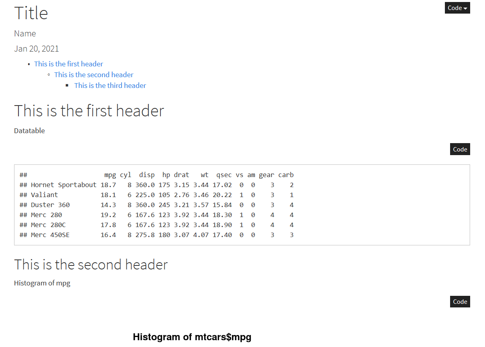
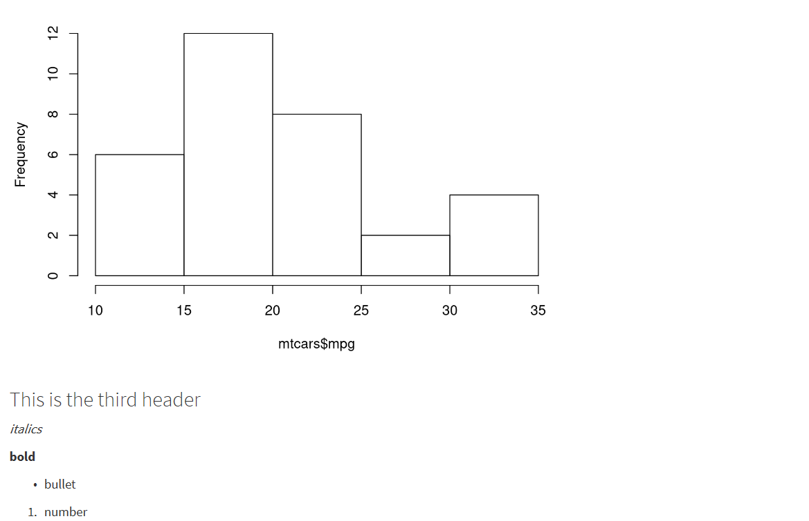
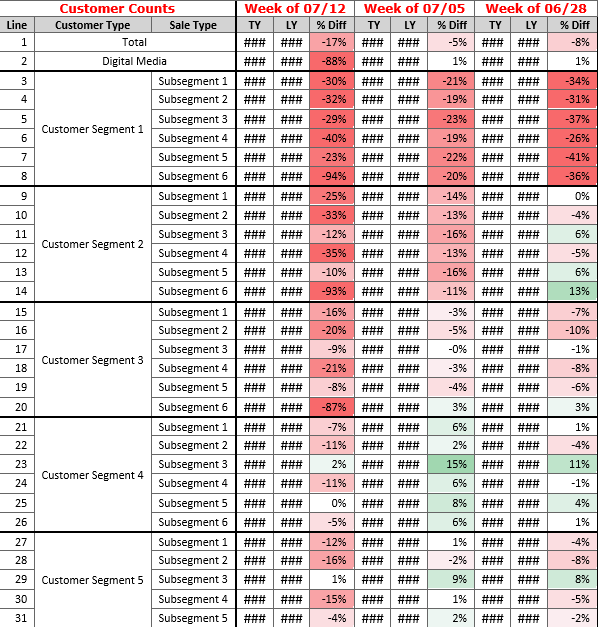

Displaying Code using R Markdown
================================

Created by Chia, Jonathan, last modified on Apr 09, 2022

# Introduction

Refer to this article when you want to organize a report that includes code

# Table of Contents

*   [Why Use R Markdown?](#why)
*   [Template for HTML report](#template)
*   [Output](#output)
*   [Outputting to Word](#word)
    *   [Officedown](#officedown)
    *   [Officer](#officer)
    *   [Flextable](#flextable)
    *   [HTML widgets and Pagedown to save HTML as picture](#pic)
*   [Other Useful Links](#links)
*   [Random Useful Code](#code)

# Why Use R Markdown? <a name="why"></a>

1.  Helps to keep your code organized
2.  Create clean reports where you can hide/show code when needed
3.  Can export as pdf, word, presentation, html, markdown, website, and dashboards
4.  Can create **automated reports** that get emailed to people

  

# Template for HTML report <a name='template'></a>

Below is the code from an R Markdown file that includes a table of contents (toc), adds code hide/show buttons (code_folding), and outputs as a html document

---
    ---
    title: 'Title'
    author: 'Name'
    date: 'Jan 20, 2021'
    output:  
        html_document:    
        toc: yes    
        number_sections: no    
        code_folding: hide    
        theme: cosmo    
        highlight: tango 
    ---

    ```{r setup, include=FALSE} 
    knitr::opts_chunk$set(echo = TRUE)
    library(dplyr)
    # load other libraries here
    ```


    # This is the first header
    Datatable

    ```{r}
    mtcars %>% filter(mpg < 21) %>% head(6)
    ```

    ## This is the second header
    Histogram of mpg

    ```{r}
    hist(mtcars$mpg)
    ```

    ### This is the third header
    _italics_

    **bold**

    - bullet

    1. number
---

# Output <a name="output"></a>

Below is the output of the above code

  





# Outputting to Word <a name="word"></a>

**Key packages:**

*   Officedown
*   Officer
*   Flextable
*   htmlwidgets
*   pagedown

### Officedown <a name="officedown"></a>

Lets you adjust page margins, landscape, columns, and other Word specific options

  

Example:

Insert this code block below your outputs that you want to be in landscape mode

```r
block_section(
  prop_section(
    type = "continuous",
    page_size = page_size(orient = "landscape", width = 14, height = 8.5),
    page_margins = page_mar(
                              bottom = .75,
                              top = .75,
                              right = .75,
                              left = .75,
                              header = 0.1,
                              footer = 0.1,
                              gutter = 0.1
                              )
))

```

  

### Officer <a name="officer"></a>

Officer has to be loaded to pair with officedown and flextable

  

### Flextable <a name="flextable"></a>

This package is so much better than DT package (unless you need DT for interactivity and filters)

  

Example:

```r
params$customer_counts %>% mutate(Line = seq(1,nrow(.))) %>% 
		select(ncol(.), 1:ncol(.)-1) %>% 
		flextable() %>% 
  		style(part = 'body', pr_t = fp_text(font.size = 6), pr_c = cell_style) %>% 
  		add_header_row(values = c('Customer Counts',
                       paste0("Week of ",
								format(as.Date(params$customer_counts_date1[1]), '%m/%d')),
                       paste0("Week of ",
								format(as.Date(params$customer_counts_date2[1]), '%m/%d')),
                       paste0("Week of ",
								format(as.Date(params$customer_counts_date3[1]), '%m/%d'))
                            ),
                       colwidths = c(3,3,3,3)) %>% 
		align(align = 'center', part = 'header') %>%
  		theme_box() %>% 
  		merge_v(j = 2) %>% 
 		merge_at(i = c(1), j = c(2,3)) %>% 
  		merge_at(i = c(2), j = c(2,3)) %>% 
  		bg(part = 'header', i = 2, bg = '#d3d3d3') %>%
  		# this next part copies the conditional formatting from excel
  		bg(j = c(6,9,12), bg = function(x) {
    			out <- rep('transparent', length(x))
    			quantile <- quantile(x, prob = seq(0,1, by = 1/21))
    			out[x >= quantile[1] & x < quantile[2]] <- '#f8696b'
    			out[x >= quantile[2] & x < quantile[3]] <- '#f87779'
    			out[x >= quantile[3] & x < quantile[4]] <- '#f88688'
    			out[x >= quantile[4] & x < quantile[5]] <- '#f99597'
    			out[x >= quantile[5] & x < quantile[6]] <- '#f9a3a6'
    			out[x >= quantile[6] & x < quantile[7]] <- '#fab2b5'
    			out[x >= quantile[7] & x < quantile[8]] <- '#fac1c3'
    			out[x >= quantile[8] & x < quantile[9]] <- '#facfd2'
    			out[x >= quantile[9] & x <= quantile[10]] <- '#fbdee1'
    			out[x >= quantile[10] & x <= quantile[11]] <- '#fbedf0'
    			out[x >= quantile[11] & x <= quantile[12]] <- '#FFFFFF'
    			out[x >= quantile[12] & x <= quantile[13]] <- '#edf6f2'
    			out[x >= quantile[13] & x <= quantile[14]] <- '#def0e5'
    			out[x >= quantile[14] & x <= quantile[15]] <- '#cfead8'
    			out[x >= quantile[15] & x <= quantile[16]] <- '#bfe4cb'
    			out[x >= quantile[16] & x <= quantile[17]] <- '#b0ddbd'
   				out[x >= quantile[17] & x <= quantile[18]] <- '#a1d7b0'
    			out[x >= quantile[18] & x <= quantile[19]] <- '#91d1a3'
    			out[x >= quantile[19] & x <= quantile[20]] <- '#82cb96'
    			out[x >= quantile[20] & x <= quantile[21]] <- '#73c589'
    			out[x >= quantile[21] & x <= quantile[22]] <- '#63be7b'
    			out
  		}) %>%
  		vline(j = c(3,12), border = border_style) %>%
  		hline(i = c(2,8,14,20,26,31), border = border_style) %>%
  		set_formatter(
        	`Date 1 YOY Diff` = function(x) format_percent_integer(x),
        	`Date 2 YOY Diff` = function(x) format_percent_integer(x),
        	`Date 3 YOY Diff` = function(x) format_percent_integer(x)
      	) %>%
  		fontsize(part = 'header', size = 6) %>% 
  		height(part = 'body', height = .2) %>%
  		hrule(rule = 'exact') %>%
  		valign(part = 'body', valign = 'top') %>%
  		valign(part = 'body', j = 2, valign = 'center') %>% 
  		# line_spacing(part = 'body', space = .5) %>% 
  		align(part = 'body', i = c(1,2), j = 2, align = 'center') %>% 
  		set_table_properties(layout = "autofit") %>% 
  		fit_to_width(12)
```

Output:



### HTML widgets and Pagedown to save HTML as picture <a name="pic"></a>

I use these two packages to save highcharter, ggplot, or plotly html charts as png files. Then I display the png in Word using include_graphics().

  

Example:

```r
highchart() %>% 
	hchart() %>%
    htmlwidgets::saveWidget(file = 'highchart1.html')

pagedown::chrome_print(input = 'highchart1.html',
             output = 'highchart1.png',
             wait = 3, format = 'png')

knitr::include_graphics('highchart1.png')
```

# Other Useful Links <a name="links"></a>

[https://rmarkdown.rstudio.com/authoring_basics.html](https://rmarkdown.rstudio.com/authoring_basics.html)

[https://bookd](https://bookdown.org/yihui/rmarkdown/r-code.html)[https://bookdown.org/yihui/rmarkdown/r-code.html](https://bookdown.org/yihui/rmarkdown/r-code.html) [own.org/yihui/rmarkdown/r-code.html](https://bookdown.org/yihui/rmarkdown/r-code.html)

[https://rmarkdown.rstudio.com/gallery.html](https://rmarkdown.rstudio.com/gallery.html)

  

# Random Useful Code <a name="code"></a>

Widen the margins of the html output - really useful when you can't fit all your columns in your tables

Put this right after the yaml section:

    <style type="text/css">
    .main-container {
      max-width: 1800px;
      margin-left: auto;
      margin-right: auto;
    }
    </style>

---

Document generated by Confluence on Apr 09, 2022 02:02

[Atlassian](http://www.atlassian.com/)
